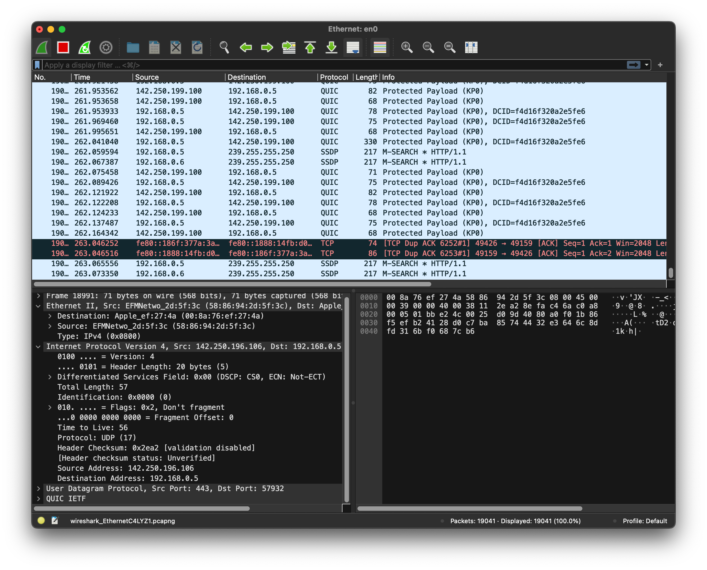

# Quest 06. 인터넷의 이해

## Introduction

- 이번 퀘스트에서는 인터넷이 어떻게 동작하며, 서버와 클라이언트, 웹 브라우저 등의 역할은 무엇인지 알아보겠습니다.

## Topics

- 서버와 클라이언트, 그리고 웹 브라우저
- 인터넷을 구성하는 여러 가지 프로토콜
  - IP
  - TCP
  - HTTP
- DNS

## Resources

- [OSI 모형](https://ko.wikipedia.org/wiki/OSI_%EB%AA%A8%ED%98%95)
- [IP](https://ko.wikipedia.org/wiki/%EC%9D%B8%ED%84%B0%EB%84%B7_%ED%94%84%EB%A1%9C%ED%86%A0%EC%BD%9C)
  - [Online service Traceroute](http://ping.eu/traceroute/)
- [TCP](https://ko.wikipedia.org/wiki/%EC%A0%84%EC%86%A1_%EC%A0%9C%EC%96%B4_%ED%94%84%EB%A1%9C%ED%86%A0%EC%BD%9C)
  - [Wireshark](https://www.wireshark.org/download.html)
- [HTTP](https://ko.wikipedia.org/wiki/HTTP)
  - Chrome developer tool, Network tab
- [DNS](https://ko.wikipedia.org/wiki/%EB%8F%84%EB%A9%94%EC%9D%B8_%EB%84%A4%EC%9E%84_%EC%8B%9C%EC%8A%A4%ED%85%9C)
  - [Web-based Dig](http://networking.ringofsaturn.com/Tools/dig.php)

## Checklist

- 인터넷은 어떻게 동작하나요? Internet Protocol Suite의 레이어 모델에 입각하여 설명해 보세요.

  - 근거리에서 서로 떨어진 두 전자기기가 유선/무선으로 서로 통신하는 프로토콜은 어떻게 동작할까요?
    > - 1계층 장비에는 리피터와 허브가 전기 신호를 정형하고 증폭하는 기능을 합니다.
    > - 전자기파로 0과 1을 표현하면서 데이터를 주고받음.
    > - 랜카드가 전기신호를 0과 1로 이루어진 데이터로 변환 하고 디지털 데이터를 전기신호로도 변환하는 역할을함
  - 근거리에 있는 여러 대의 전자기기가 서로 통신하는 프로토콜은 어떻게 동작할까요?
    > - 2계층 모델인 data-link layer(데이터링크)계층 에서 스위치 라는 장비를 통해 데이터를 주고받게됨(같은 네트워크안에서)
  - 아주 멀리 떨어져 있는 두 전자기기가 유선/무선으로 서로 통신하는 프로토콜은 어떻게 동작할까요?
    > - 3계층인 네트워크 레이어에서 라우팅을 통하여 ip주소로 위치를 알아내고 데이터를 주고받게됨
  - 두 전자기기가 신뢰성을 가지고 통신할 수 있도록 하기 위한 프로토콜은 어떻게 동작할까요?
    > - 4계층 전송계층인 TCP 프로토콜이 있음.
    > TCP 프로토콜은 두 개의 호스트를 연결하고 데이터 스트림을 교환하게 해주는 네트워크 프로토콜입니다. 데이터와 패킷이 순서대로 전송되는 것을 보장해 주며 에러가 없이 패킷이 신뢰할 수 있게 전달 되었는지 보장해 줍니다. 3 Way Handshake를 통해 연결이 성립됩니다.
    >
    > 1. 클라이언트가 서버에서 SYN 메시지 전송
    > 2. 서버가 클라이언트에게 SYN-ACK 메시지 전송
    > 3. 클라이언트가 서버에게 ACK 메시지 전송
    > 연결을 종료할 때는 4 Way Handshake를 사용합니다

  - HTTP는 어떻게 동작할까요?
    > - 5,6,7계층을 묶어서 어플리케이션 레이어 표현하며 여기에 속함.
    > - TCP 통신으로 동작함.
    > ### 동작방식
    > 1. 클라이언트는 서버에 대한 TCP connection(port 80)을 열어 놓는다.
    > 2. 서버는 클라이언트로부터 TCP커넥션을 받는다.
    > 3. 웹(서버)과 브라우저(클라이언트)는 HTTP메세지를 교환한다.
    > 4. TCP커넥션을 닫는다.
- 우리가 브라우저의 주소 창에 www.knowre.com 을 쳤을 때, 어떤 과정을 통해 서버의 IP 주소를 알게 될까요?
  > - DNS 서버에 접속해 URL 주소 중에 도메인 명에 해당하는 "knore"를 검색해 도메인 명에 맞는 IP 주소를 가져옵니다

## Quest

- tracert(Windows가 아닌 경우 traceroute) 명령을 통해 www.google.com 까지 가는 경로를 찾아 보세요.
  - 어떤 IP주소들이 있나요?
  - 그 IP주소들은 어디에 위치해 있나요?
    > - 검색사이트 https://xn--c79as89aj0e29b77z.xn--3e0b707e/ 
    > - 한국 ip에서는 성남시 분당구에 있는 케이티가 나옵니다.
- Wireshark를 통해 www.google.com 으로 요청을 날렸을 떄 어떤 TCP 패킷이 오가는지 확인해 보세요
  > - 어떻게 봐야하는건지 아직 잘모르겠습니다.
  > - 
  - TCP 패킷을 주고받는 과정은 어떻게 되나요?
  - 각각의 패킷에 어떤 정보들이 담겨 있나요?
- telnet 명령을 통해 http://www.google.com/ URL에 HTTP 요청을 날려 보세요.
  - 어떤 헤더들이 있나요?
    > Date / Expires / Cache-control / Content-Type / P3P / Server / Set-Cookie / Transfer-Encoding 등등...
  - 그 헤더들은 어떤 역할을 하나요?
    > 부가적인 정보들을 전송할 수 있도록 해줍니다.
    > 응답이 만료된 시간 / 캐싱 지시문 / 자격 증명 / 데이터타입 / 등등...

## Advanced

- HTTP의 최신 버전인 HTTP/3는 어떤 식으로 구성되어 있을까요?
  > UDP기반의 QUIC프로토콜 사용
- TCP/IP 외에 전세계적인 네트워크를 구성하기 위한 다른 방식도 제안된 바 있을까요?
