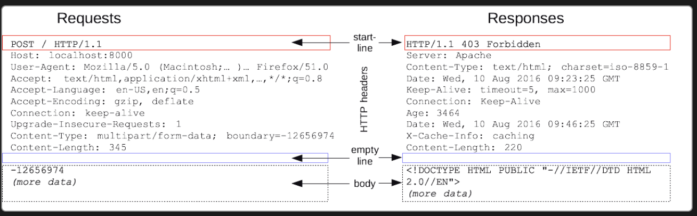

# Quest 08. 웹 API의 기초

## Introduction
* 이번 퀘스트에서는 웹 API 서버의 기초를 알아보겠습니다.

## Topics
* HTTP Method
* node.js `http` module
  * `req`와 `res` 객체

## Resources
* [MDN - Content-Type Header](https://developer.mozilla.org/en-US/docs/Web/HTTP/Headers/Content-Type)
* [MDN - HTTP Methods](https://developer.mozilla.org/en-US/docs/Web/HTTP/Methods)
* [MDN - MIME Type](https://developer.mozilla.org/en-US/docs/Glossary/MIME_type)
* [Postman](https://chrome.google.com/webstore/detail/postman/fhbjgbiflinjbdggehcddcbncdddomop)
* [HTTP Node.js Manual & Documentation](https://nodejs.org/api/http.html)

## Checklist
* HTTP의 GET과 POST 메소드는 어떻게 다른가요?
  > * GET: 서버로 어떠란 리소스로 부터 정보를 요청하기 위해 사용
  >   * 요청에 필요한 데이터는 쿼리스트링으로 전송
  >   * 캐싱이 가능함
  >   * 브라우저 히스토리에 남음
  > * POST: 리소스를 생성/업데이트하기 위해 서버에 데이터를 보낼때 사용
  >   * 데이터는 body에 담아서 전송
  >   * 캐싱이 되지 않음
  >   * 브라우저 히스토리에 남지 않음
  >   * POST에서는 멱등성이 보장되지 않음
  >     - 멱등성: 같은 행위를 반복하더라도 같은 효과를 가짐

  * 다른 HTTP 메소드에는 무엇이 있나요?
  > * HEAD: GET의 요청와 동일한 응답을 요하지만, 응답 본문을 포함하지 않습니다 (HEAD 값만 응답 받음)
  > * PUT: 리소스를 생성/ 업데이트 하기 위해 사용, POST와 용도는 같지만 PUT은 부수효과가 없는 멱등성을 가집니다.
  > * DELETE: 특정 리소스를 삭제합니다.
  > * CONNECT: 요청한 리소스에 대해 양방향 연결을 시작하는 메소드입니다. 터널을 열기 위해서 사용됨.
  > * OPTIONS: 서버와 브라우저가 통신하기위한 통신 옵션을 확인하기 위해 사용. 주로 preflight를 수행할때 사용됨.
  >   * preflight란? : 브라우저가 서버와 통신하기 이전에 해당 서버의 옵션들을 확인하기 위한 요청.
  > * TRACE: 목적 리소스의 경로를 따라 메세지 loop-back을 테스트함
  >   * 자신의 요청이 서버에 도달했을 때 어떻게 보이게 되는지 알려줌
  >   * 주로 진단을위해 디버깅용도로 사용된다.
  > * PATCH: 리소스의 부분만을 수정할때 사용.
  >   * put과 달리 비멱등성이며, put은 문서자체의 완전한 교체만을 허용하는 반면 patch는 부분적인 수정을 할때 사용됩니다.

  > * 참고블로그
  > https://feel5ny.github.io/2019/08/16/HTTP_003_02/

* HTTP 서버에 GET과 POST를 통해 데이터를 보내려면 어떻게 해야 하나요?
  > * http 메세지로 데이터를 보내야함
  >
  > MDN https://developer.mozilla.org/en-US/docs/Web/HTTP/Messages
  * HTTP 요청의 `Content-Type` 헤더는 무엇인가요?
    > * 브라우저는 content-type헤더를 기준으로 http 메세지에 담긴 데이터를 분석과 파싱을 하기 때문에 데이터의 유형을 알려주는 역할을 합니다.
  * Postman에서 POST 요청을 보내는 여러 가지 방법(`form-data`, `x-www-form-urlencoded`, `raw`, `binary`) 각각은 어떤 용도를 가지고 있나요?
    > * form-data: ASCII문자 값과 함께 바이너리 데이터를 전송할때 사용합니다. 즉, 텍스트와 함께 파일을 부할때 사용됩니다.
    > * x-www-form-urlencoded: key-value값의 문자 데이터들을 인코딩하여서 전송함
    > * raw: 문자열로 데이터를 그대로 전송하고 싶을때 사용함.
    > * binary: 수동으로 입력할수없는 정보를 보낼때 사용합니다. 바이너리로 변환하여 전송.
    > postman 문서: https://learning.postman.com/docs/sending-requests/requests/#sending-body-data
* node.js의 `http` 모듈을 통해 HTTP 요청을 처리할 때,
  * `req`와 `res` 객체에는 어떤 정보가 담겨있을까요?
    > * req: http.IncomingMessage 객체로 데이터가 넘어옵니다.
    >   * url, method, headers, httpVersion, trailers 등등 요청에 대한 정보가있습니다.
    > * res: http.ServerResponse 객체로 전달되며 메소드를 활용하여 응답 헤더와 응답본문을 작성해야합니다.
  * GET과 POST에 대한 처리 형태가 달라지는 이유는 무엇인가요?
    > * get방식은 url에 쿼리스트링으로 데이터가 오는반면, post는 body에 데이터가 담아져서 옵니다.
    > * 멱등성때문일까요? GET은 단순히 리소스 조회하는 역할이고, 멱등성을 가지기 때문에 응답방식이 항상 같습니다.
    > * POST는 리소스의 상태를 바꾸기때문에 응답방식이 달라짐
* 만약 API 엔드포인트(URL)가 아주 많다고 한다면, HTTP POST 요청의 `Content-Type`에 따라 다른 방식으로 동작하는 서버를 어떻게 정리하면 좋을까요?
  > * content-type에 따라 데이터를 파싱하는 방법이 다르기때문에 나누는 것일까요??.. 어떤방식을 이야기하는지 감이 잘 안잡힙니다..
  * 그 밖에 서버가 요청들에 따라 공통적으로 처리하는 일에는 무엇이 있을까요? 이를 어떻게 정리하면 좋을까요?
    > * express의 경우에는 미들웨어를 사용하여 공통적으로 일을 처리하였습니다.
    > * 500번 응답에 대한 에러처리와 존재하지 않는 리소스를 참조할려고하는 404번 응답이 있을 것 같습니다.
    > * express의 경우에는 미들웨어중 마지막 경로에서 모아서 처리하였었습니다.

## Quest
* 다음의 동작을 하는 서버를 만들어 보세요.
  * 브라우저의 주소창에 `http://localhost:8080`을 치면 `Hello World!`를 응답하여 브라우저에 출력합니다.
  * 서버의 `/foo` URL에 `bar` 변수로 임의의 문자열을 GET 메소드로 보내면, `Hello, [문자열]`을 출력합니다.
  * 서버의 `/foo` URL에 `bar` 키에 임의의 문자열 값을 갖는 JSON 객체를 POST 메소드로 보내면, `Hello, [문자열]`을 출력합니다.
  * 서버의 `/pic/upload` URL에 그림 파일을 POST 하면 서버에 보안상 적절한 방법으로 파일이 업로드 됩니다.
  * 서버의 `/pic/show` URL을 GET 하면 브라우저에 위에 업로드한 그림이 뜹니다.
  * 서버의 `/pic/download` URL을 GET 하면 브라우저에 위에 업로드한 그림이 `pic.jpg`라는 이름으로 다운로드 됩니다.
* expressJS와 같은 외부 프레임워크를 사용하지 않고, node.js의 기본 모듈만을 사용해서 만들어 보세요.
* 처리하는 요청의 종류에 따라 공통적으로 나타나는 코드를 정리해 보세요.

## Advanced
* 서버가 파일 업로드를 지원할 때 보안상 주의할 점에는 무엇이 있을까요?
  > ### 취약점
  > * 확장자 필터링이 미흡할 경우, 악성파일이 업로드되어 시스템을 장악할 수 있음
  > * 다량의 대용량 파일을 연속 전송하여 시스템의 부하 및 장애를 유발할 수 있음
  > ### 대응책
  > * content-type에 대한 정보를 확인하여 해당 파일 타입을 허용가능한 수준으로 관리도록 검증필요 (파일 확장자 필터링)
  > * 업로드 파일크기에 따른 제한을 둠.
