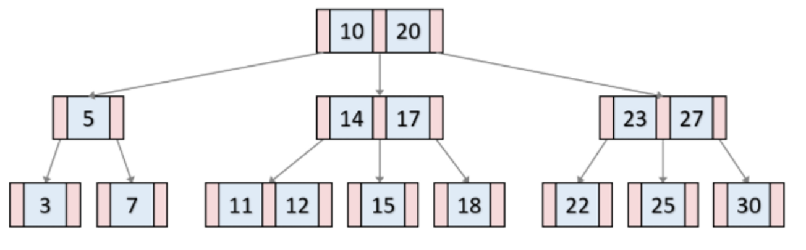

# Quest 11. RDB의 기초와 ORM

## Introduction
* 이번 퀘스트에서는 데이터베이스를 다루는 방법에 대해 알아보겠습니다.

## Topics
* RDBMS
* MySQL
* ORM
* Hash
  * scrypt

## Resources
* [MySQL 101 – The basics](https://www.globo.tech/learning-center/mysql-101-basics/)
* [Sequelize](https://sequelize.org/)
* [안전한 패스워드 저장](https://d2.naver.com/helloworld/318732)

## Checklist
* RDBMS 테이블의 정규화는 무엇인가요?
  > * 관계형 데이터 베이스를 설계할때 중복을 최소화하면서 데이터 구조를 짜는 프로세스 입니다.
  > * 주로 primary key를 기준으로 관계 되어있지않은 항목들을 분리하는 방식으로 진행됩니다.
  > * 정규화는 크게 7단계 까지 있으며, 실무에서는 보통 3차 정도까지만 쓰지만, 5차까지도 쓸때가 있다고합니다. 6~7 단계는 연구수준의 정규화 라고 합니다.
* MySQL 외의 RDB에는 어떤 것들이 있나요?
  > * **postgreSQL**
  > * 오라클
  > * 마리아DB
  > * IBM Db2 ...
  > 
  > db인기순위 보기:  https://db-engines.com/en/ranking
  * Relational Database 외에 다른 DB에는 어떤 것들이 있을까요?
    > * NoSQL: MongoDB, hbase
    > * In-Memory: redis (인 메모리 방식이면서도 key-value로 동작하는 Nosql입니다)
* RDBMS에서 테이블의 인덱싱은 무엇인가요? 인덱싱을 하면 어떤 점이 다르며, 어떤 식으로 동작하나요?
  > * 인덱싱이란: 검색속도를 높이기 위해 사용하는 기술 입니다.
  > * 많이 쓰이는 인덱싱 자료구조에는 B-tree(비 트리), B+tree(비 플러스 트리)가 있습니다.
  > * 둘다 탐색속도가 logN인 Binary tree에서 발전된 트리 모양입니다.
  > #### B-tree
  > 
  > - 모든 리프노드들이 같은 레벨을 가지도록 자동으로 균형을 마주는 트리입니다.
  > - 군형이 맞춰져있고 하나의 노드에 한개 이상의 데이터를 가지고 있어서 이진트리보다 적은 횟수로 많은 데이터를 찾을수가 있습니다.
  > #### B+tree
  > 
  > - b-tree에서 확장된 개념으로, 브랜치 노드에 key만 담아두고, 오직 리프노드에만 key와 데이터를 저장하고, 리프노드끼리 Linked List로 연결이 되어있는 형식입니다.
  > - leaf 노드 끼리 연결리스트로 연결되어있어서 범윝 탐색에 매우 유리합니다. 단점으로는 무조건 leaf노드까지 내려가야 데이터를 찾을수 있다는 점 입니다.
  >  
  >
  > ###### Q2: 크키를 알수없는 긴 텍스트의 경우는 인덱싱이 불가능한 이유... (면접때 질문 받았던 내용이나, 서치를 해도 관련된 내용을 찾을수가 없었음)
  >
* ORM을 사용하는 것은 사용하지 않는 것에 비해 어떤 장단점을 가지고 있나요?
  > * 장점
  >   * 직관적인 코드(가독성 증가) + 비지니스 로직 집중 가능(생산성 증가가
  >     - SQL쿼리문이 아닌 객체의 메서드로 데이터를 조작함으로써 더 직관적임
  >   * 재사용 및 유지보수 편리성 증가
  >   * DB에 종속적이지 않음 (다른 db로 쉽게 교체 가능)
  >   * sql문에 익숙하지않은 개발자도 사용하기 용이해짐
  >
  > * 단점
  >   * SQL이 아닌 ORM을 배우고 익히게 된다는 단점이 있습니다.
  >   * 일부 쿼리는 ORM 만으로는 작업이 불가능한 경우가 있음
  >   * 프로젝트의 복잡성이 커질수록 난이도가 올라갑니다.
  >   * 복잡한 ORM 호출은 비효율적일 수가 있습니다.
  >     - 간단한 쿼리문도 정의된 관계 때문에 쿼리문이 복잡해질 수가 있음
  >   * 잘못 구현된 경우 일관성이 무너지는 문제점이 생길 수가 있음
  * 자바스크립트 생태계의 ORM에는 어떤 것들이 있나음?
    > * **Prisma**
    > * **TypeORM**
    > * Sequelize.js
    > * Knex
* 모델간의 1:1, 1:N, N:M 관계는 각각 무엇이고 어떨 때 사용하나요?
  > ### 1:1
  > - 하나의 레코드가 다른테이블의 레코드 한개와 연결된 경우입니다.
  > - 예시로는 우리나라의 결혼제도는 일부일처제로, 결혼에 있어서 남자 여자가 1:1 관계를 이루게됩니다.
  > - 이처럼 반드시 개체 하나에 매핑되는 경우일 때 사용되게됩니다.
  > ### 1:N
  > - 일대다의 관계로, 한쪽이 관계를 맺은 여러객체를 가질수있음을 의미합니다.
  > - 예시로는 게시글 하나에 댓글이 여러개 달릴수가있으므로 게시글과 댓글의 관계가 될 수 있습니다.
  > ### N:M
  > - 다대다 관계 로, 서로가 서로를 1:N 관계로 보고있는 관계를 의미합니다.
  > - 예시로는 수업과 학생들의 관계에 있어서 학생은 여러개의 수업을 들을수가 있고, 수업은 해당 수업을 듣는 여러명의 학생들을 가지는 구조입니다.
* DB에 사용자의 암호를 평문으로 저장하지 않고도 사용자의 암호를 인증하는 것이 가능한 이유는 무엇일까요?
  > * 해시함수로 암호화를하면 같은 입력 값에 따른 고유한 출력값이 보장되기때문에 가능합니다.
  > * 해시함수는 복호화가 안되는 단방향 암호화 방식 입니다.
  * 해시 함수에는 어떤 것이 있나요?
    > * MD5
    >   - 1990년대부터 사용된 알고리즘으로, 해시충돌이 발견되어서 사용되지않고 있습니다.
    > * SHA(Secure Hash Algorithm)
    >   - 1993년에 처음 설계되었음. (sha-0)
    >   - 현재 sha-256이 주로 사용되어지고있음
    > * Bcrypt
    > * Scrypt
  * 사용자의 암호를 해싱하여 저장할 때 어떤 식으로 저장하는 것이 보안에 좋을까요?
    > 해싱함수를 사용하여도 입력값에 따른 출력값이 동일하기때문에 이를 알려주는 테이블인 레인보우테이블에 의해서 출력값으로 입력값을 찾아낼수가 있습니다. 그래서 salt라고 하는 랜덤한 임의의 문자열을 추가하여서 암호화를 해야합니다.
## Quest
* 이번에는 메모장을 파일이 아닌 DB기반으로 만들어 보고자 합니다.
  * 적절한 테이블을 설계해 보세요.
  * Sequelize를 이용하여 데이터의 모델을 만들고 어플리케이션에 적용해 보세요.
  * 사용자의 비밀번호는 해싱을 통해 저장되어야 합니다.

## Advanced
* Object–relational impedance mismatch란 어떤 개념인가요?
  > - 객체모델을 관계형 모델에 저장할때 발생하는 문제로, 패러다임 불일치에서 오는 문제를 이야기합니다. 이를 해결해야 하는게 ORM의 과제라고 할수 있습니다.
  > - RDBMS는 테이블형식으로 데이터를 표현하는 반면, 객체지향 모델은 그래프로 표현하고, 객체지향에서는 상속이라는 기능이 있지만, 데이터베이스는 없고 서로 구조적으로 설계 단계부터 다른모습을 취하고 있기 때문에 패러다임의 불일치가 발생함

* Foreign Key란 무엇인가요? 이것을 사용할 때의 장점과 단점은 무엇일까요?
  > - 외래키란 테이블과 테이블을 이어주는 역할을 하고있습니다.
  > - 장점
  >   - 참조 무결성(Referential Integrity)을 유지할 수 있음(테이블의 수정이 일어날시 외래키로 이어진 다른 테이블도 같이 수정이됨)
  > - 단점
  >   - 성능이 느려집니다.
  >     - 데이터 생성 및 수정시 항상 무결성 검사를 수행하게됨 (예를 들면 자식 테이블에 데이터를 추가할때 부모 테이블에 primary key가 있는지 확인하는 작업)
  >   - 개발할때 불편함.
  >     - 부모 테이블 변경시 자식테이블의 구조에 이상이 없는지 확인하여야함.
  >     - 테이블 관계가 종속되어있어서 테스트를 할때 어려움이 있음
* 이전에 쓰이던 해시함수들에는 어떤 것이 있을까요? 패스워드 해싱의 추세의 역사는 어떻게 이어져왔나요?
  > - 이전에 쓰이던 MD5, SHA-0, SHA-1 등등이 있습니다.
  > - 기존의 해시함수가 시간이 지나면서 다른 인풋값에 같은 값이 나오는 해시충돌이 발견되면서 못쓰게되었고, 기존의 해싱함수를 개선하면서 대체할수 있는 다른 해싱함수들도 등장하게 되었습니다.
  > 
  > 출저: 한국인터넷진흥원 https://seed.kisa.or.kr/kisa/intro/EgovHistory.do
